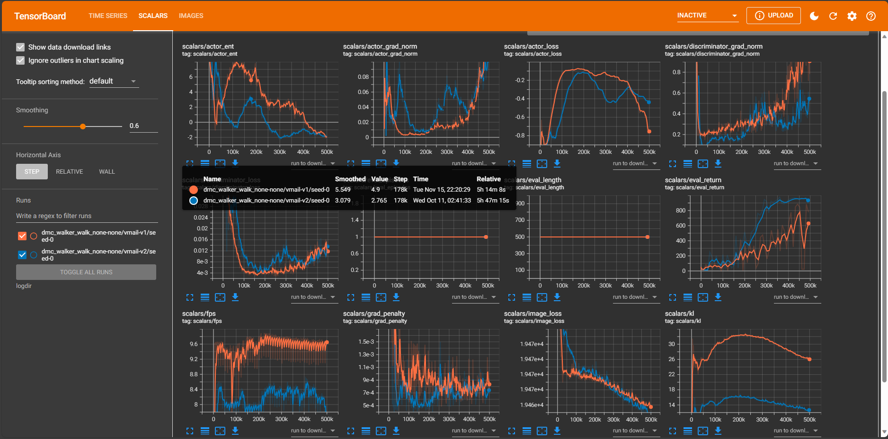
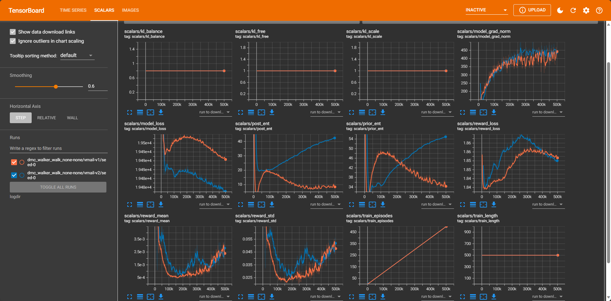
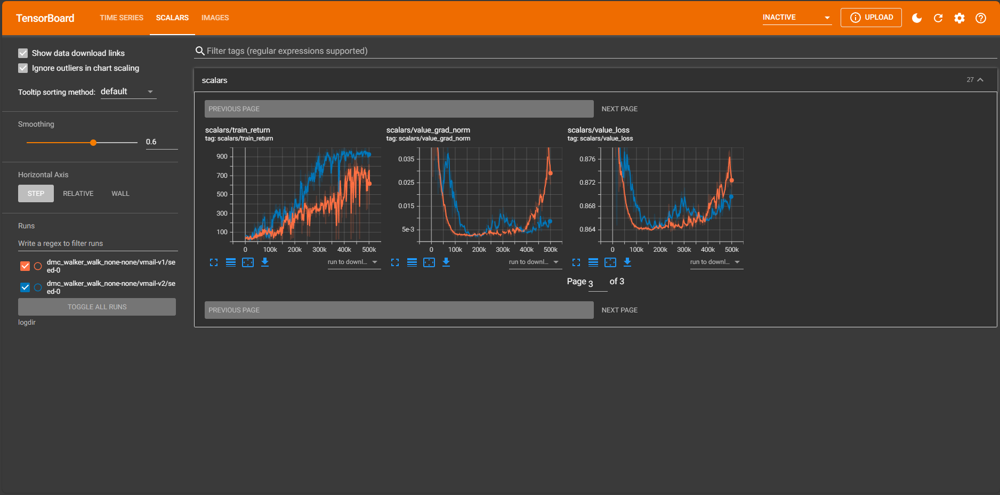

# VMAIL-torch

Pytorch version of "VMAIL: Visual Adversarial Imitation Learning using Variational Models" (https://github.com/rmrafailov/VMAIL).

As we can see, for almost tasks, it shows similar performance with VMAIL when comparing the reported performance on paper and from running codes.

The below logs are from Tensorboard, you also can see through [Tensorboard logs](http://localhost:6006/?darkMode=true#scalars&_smoothingWeight=0.634).

- DMC walker walk task






## How to use
For required packages to run this, you can find from [requirements.txt](https://github.com/jsikyoon/dreamer-torch/blob/main/requirements.txt). 

The command to run the code. 

V1
```
MUJOCO_GL=egl python vmail.py --logdir logdir --expert_datadir ./data/expert-none/walker_walk_expert --task dmc_walker_walk_none-none --configs defaults dmc --batch_size 64
```

V2
```
MUJOCO_GL=egl python vmail.py --logdir logdir --expert_datadir ./data/expert-none/walker_walk_expert --task dmc_walker_walk_none-none --configs defaults dmc --batch_size 64 --dyn_discrete 32 --dyn_stoch 32 --prefill 5000 --device cuda:3
```

**Acknowledgements**

Our codes heavily rely on the [repository](https://github.com/jsikyoon/dreamer-torch)